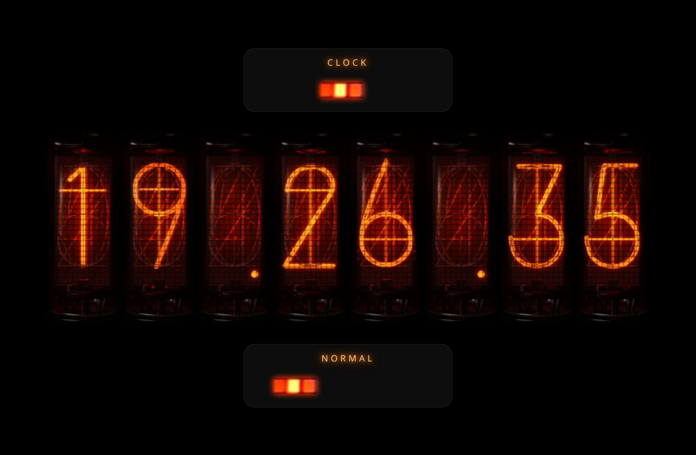

# Nixie Tube Clock

A retro nixie‑tube **clock / stopwatch / countdown**, inspired by the Divergence
Meter from _Steins;Gate_. Eight glowing tubes render the time, and a single
decimal readout can also show it normalized to days, hours, minutes, or seconds.

Built with TypeScript, [Rspack](https://rspack.rs), and Tailwind CSS v4 — as a
set of small, decoupled, light‑DOM web components.



## Quick start

```bash
npm install
npm run dev      # dev server at http://localhost:8080
npm run build    # production build to dist/
npm run preview  # preview the production build
npm run lint     # eslint
npm run format   # prettier
```

## How it works

The core idea is a **one‑way pipeline** with each stage decoupled from the next:

```
TimeSource ──ms──▶ ContentFormatter ──glyph[8]──▶ NixieDisplay ──▶ tubes
 (clock /            (Normal / Day /              (8 cells of
  stopwatch /         Hours / … )                  preloaded images)
  countdown)
```

- A **time source** only knows how to produce a number of milliseconds
  (`readMs()`). It knows nothing about formatting or rendering.
- A **formatter** maps that millisecond value to a fixed array of 8 glyph keys
  (e.g. `['1','2','.','3','4','.','5','6']`). Formatters take a _duration_, so the
  same ones work for wall‑clock time, elapsed stopwatch time, and remaining
  countdown time.
- The **display** (`<nixie-display>`) only knows how to draw an array of 8 glyph
  keys. It knows nothing about time.
- A small **driver** (`startClock`) ties them together on each animation frame
  and can swap the source or formatter live.

This separation is why a new mode or a new readout is additive: implement a
`TimeSource` (or add a formatter) and wire it in the composition root
(`src/index.ts`) — the display and driver are untouched.

### Image preloading / caching (zero‑flicker swaps)

The tubes are images, and the display must update smoothly (every second, or
every frame). The strategy:

- Every glyph for **every** cell is a persistent `` in the DOM, stacked,
  with only one opaque at a time.
- On startup all images are `decode()`‑d up front (`display.ready` resolves when
  done). Identical image URLs share **one** decoded bitmap in the browser cache.
- Updating a cell is a single **opacity flip** between already‑decoded layers —
  no network, no decoding, no layout — so swaps are instant and flicker‑free.
- `setContent` only touches cells whose glyph actually changed.

### Auto‑fade controls

The switch/button controls fade out after inactivity so the tubes stay the
focus, and reappear on any activity — **without relying on `:hover`** (which
doesn't exist on touchscreens):

- One shared page timer toggles a `data-idle` attribute on the root element.
- Controls fade together via the Tailwind `group-data-[idle]` variant (quick to
  reveal, gentle to fade).
- Any `pointermove` / `pointerdown` / `touchstart` / `keydown` reveals them and
  resets the timer; while a control is hovered or pressed the timer is held off
  so it can't fade mid‑interaction.

### Persistence (stopwatch & countdown)

Both timers survive reloads and tab closes by storing **absolute timestamps** in
`localStorage` and deriving the elapsed/remaining value from `Date.now()`:

- **Stopwatch** (`nixie:stopwatch`): on start it stores `startedAt`; elapsed is
  always `accumulated + (now − startedAt)`. Pause banks the elapsed; resume
  starts a fresh reference; reset clears it.
- **Countdown** (`nixie:countdown`): on start it stores `endsAt = now +
remaining`; remaining is always `max(0, endsAt − now)`, clamped at zero. If it
  finished while the window was closed, it restores as the zero/finished state
  (never negative). It clamps and stops at zero and fires an `onComplete`
  callback (the display pulses while a finished countdown is on screen).

## Components & API

All components are **light‑DOM custom elements** (no shadow root) so the global
Tailwind utility classes apply. Each is registered once via a static
`register()` and configured imperatively from the composition root.

### `<nixie-display>` — the renderer

```ts
import { NixieDisplay } from './nixie/nixie-display';

NixieDisplay.register(); // defines <nixie-display> (optional custom tag name)

const display = document.querySelector<NixieDisplay>('nixie-display')!;
await display.ready; // images decoded, safe to render
display.setContent(['1', '2', '.', '3', '4', '.', '5', '6']); // shows "12.34.56"
```

| Member                                   | Description                                                                                                                           |
| ---------------------------------------- | ------------------------------------------------------------------------------------------------------------------------------------- |
| `static register(tag = 'nixie-display')` | Define the element (idempotent).                                                                                                      |
| `ready: Promise<void>`                   | Resolves once every glyph image is decoded.                                                                                           |
| `setContent(content: GlyphCell[])`       | Set the 8 cells. Each entry is a glyph key or `null` (blank/OFF). Unknown or missing entries render blank. Only changed cells update. |
| `DISPLAY_SIZE` (export)                  | `8` — the cell count.                                                                                                                 |

The display is fixed at 8 cells; responsive sizing is applied from the outside
(see `index.html` / `index.ts`).

#### The glyph map

Glyphs are registered in one place — `src/nixie/assets.ts`:

```ts
export const GLYPHS = {
  '0': d0,
  '1': d1,
  /* … */ '9': d9,
  '.': separator,
  // ':' : colon,  // TODO: add numbers/10.png and register it here
} as const;

export type GlyphKey = keyof typeof GLYPHS; // '0'..'9' | '.'
export type GlyphCell = GlyphKey | null; // null = blank / OFF cell
export const BLANK_SRC: string = d0; // image for the null cell
```

**To add a glyph:** import its image and add one entry to `GLYPHS`. The display
automatically builds a preloaded layer for it in every cell — nothing else
changes.

### Time sources

A time source implements `TimeSource` (`src/nixie/clock.ts`):

```ts
export interface TimeSource {
  readMs(): number;
}
```

| Source            | Key methods                                                                                                                                                                   |
| ----------------- | ----------------------------------------------------------------------------------------------------------------------------------------------------------------------------- |
| `WallClockSource` | `readMs()` → ms since local midnight (DST‑safe).                                                                                                                              |
| `StopwatchSource` | `readMs()` → elapsed ms · `start()` · `pause()` · `reset()` · `get running`                                                                                                   |
| `CountdownSource` | `readMs()` → remaining ms (clamped ≥ 0) · `start()` · `pause()` · `reset()` · `setDuration(ms)` · `get running` · `get finished` · `get duration` · `onComplete?: () => void` |

`StopwatchSource` and `CountdownSource` accept an optional `Storage` in their
constructor (defaults to `localStorage`).

### `startClock` — the driver

```ts
import { startClock } from './nixie/clock';
import { WallClockSource } from './nixie/clock';
import { REPRESENTATIONS } from './nixie/representations';

const clock = startClock(
  display,
  new WallClockSource(),
  REPRESENTATIONS[0].format,
);

clock.setSource(stopwatch); // swap the time source live
clock.setFormat(REPRESENTATIONS[2].format); // swap the formatter live (→ Hours)
clock.stop(); // stop the animation loop
```

`startClock(display, source, format): ClockController` reads the source every
animation frame, formats it, and pushes the result to the display.
`ClockController` exposes `stop()`, `setSource(source)`, and `setFormat(format)`.

### Representations (formatters)

`src/nixie/representations.ts` exports the formatters and a registry. A
`ContentFormatter` is `(ms: number) => GlyphCell[]`.

| Label   | Export      | Output (for the same instant / duration) |
| ------- | ----------- | ---------------------------------------- |
| Normal  | `toClock`   | `HH.mm.ss`                               |
| Day     | `toDay`     | fraction of a day, e.g. `0.500000`       |
| Hours   | `toHours`   | hours, e.g. `12.00000`                   |
| Minutes | `toMinutes` | minutes, e.g. `720.0000`                 |
| Seconds | `toSeconds` | seconds, e.g. `43200.00`                 |

```ts
export const REPRESENTATIONS: readonly {
  label: string;
  format: ContentFormatter;
}[];
```

The normalized formatters fill all 8 cells with a single decimal (integer part,
a dot, then as many fractional digits as fit). **To add a representation:** add
a `{ label, format }` entry and bump the representation switch's state count.

### `<nixie-switch>` — the horizontal selector

A 2/3/5‑state knob switch (mouse tap, touch tap + swipe/drag, and keyboard
arrows/Home/End). It reports the selected index via both an `onChange` callback
and a bubbling `change` event.

```ts
import { NixieSwitch } from './nixie/nixie-switch';

NixieSwitch.register();
const sw = document.querySelector<NixieSwitch>('#mode-switch')!;

sw.configure({
  states: 3, // 2 | 3 | 5
  labels: ['Stopwatch', 'Clock', 'Countdown'], // length must equal states
  value: 1, // initial index (default 0)
  ariaLabel: 'Mode',
  onChange: (index, label) => console.log(index, label),
});

// Or react to the DOM event:
sw.addEventListener('change', (e) => {
  const { index, label } = (e as CustomEvent<{ index: number; label: string }>)
    .detail;
});

sw.value = 0; // set selection programmatically (no event fired)
sw.value; // current index
sw.selectedLabel; // current label
```

| `NixieSwitchConfig` field           | Description                                        |
| ----------------------------------- | -------------------------------------------------- |
| `states: 2 \| 3 \| 5`               | Number of detents.                                 |
| `labels: string[]`                  | One label per state (shown as the active readout). |
| `value?: number`                    | Initial selected index (default `0`).              |
| `ariaLabel?: string`                | Accessible name.                                   |
| `onChange?: (index, label) => void` | Fired on user selection.                           |

The switch maps states to knob graphics by position (`2 → [1,5]`, `3 → [1,3,5]`,
`5 → [1..5]`); the detent geometry is measured in `assets.ts`. The pure helper
`nearestIndex(fraction, centers)` is exported for testing.

### `<nixie-buttons>` — the action group

A row of labeled action buttons (e.g. Start / Pause / Reset), styled to match
the switch and faded by the same idle system.

```ts
import { NixieButtons } from './nixie/nixie-buttons';

NixieButtons.register();
const actions = document.querySelector<NixieButtons>('#stopwatch-actions')!;

actions.configure({
  ariaLabel: 'Stopwatch controls',
  buttons: [
    { label: 'Start', onPress: () => stopwatch.start() },
    { label: 'Pause', onPress: () => stopwatch.pause() },
    { label: 'Reset', onPress: () => stopwatch.reset() },
  ],
});
```

### `installIdleAutoHide` — central auto‑fade

```ts
import { installIdleAutoHide } from './nixie/idle';

const teardown = installIdleAutoHide({
  root: document.body, // must have class="group"
  switchSelector: 'nixie-switch, nixie-buttons',
  idleMs: 4000,
});
```

It toggles `data-idle` on `root`; controls fade via their
`group-data-[idle]:opacity-20` classes. The `root` element needs the Tailwind
`group` class. Returns a teardown function that removes the listeners.

## Usage examples

### A bare clock

```html
<body class="bg-black group">
  <main class="flex min-h-dvh items-center justify-center">
    <nixie-display class="w-[min(1440px,90vw)] max-w-full"></nixie-display>
  </main>
</body>
```

```ts
import { NixieDisplay } from './nixie/nixie-display';
import { WallClockSource, startClock } from './nixie/clock';
import { toClock } from './nixie/representations';

NixieDisplay.register();
const display = document.querySelector<NixieDisplay>('nixie-display')!;
startClock(display, new WallClockSource(), toClock);
```

### Driving the display directly

```ts
await display.ready;
display.setContent(['0', '.', '1', '2', '3', '4', '5', '6']); // "0.123456"
display.setContent(['1', '2', '3', '4', '5', '6', '7', '8']); // "12345678"
display.setContent([null, null, '4', '2', null, null, null, null]); // mostly blank
```

### Switching modes (stopwatch)

```ts
import { StopwatchSource } from './nixie/stopwatch';

const stopwatch = new StopwatchSource(); // restores any saved state
clock.setSource(stopwatch); // display now shows elapsed time
// wire Start/Pause/Reset to stopwatch.start() / .pause() / .reset()
```

The full wiring of all three modes, the shared representation switch, the
per‑mode controls, and the idle auto‑hide lives in `src/index.ts`.

## Project structure

```
index.html              # page layout: three sections + responsive sizing
rspack.config.ts        # bundler config + image asset rule
src/
  index.ts              # composition root: wires modes, sources, controls
  index.css             # @import "tailwindcss"
  assets.d.ts           # *.png module typing
  nixie/
    nixie-display.ts    # <nixie-display> renderer (glyph layers, preloading)
    nixie-switch.ts     # <nixie-switch> 2/3/5-state selector
    nixie-buttons.ts    # <nixie-buttons> action group
    clock.ts            # TimeSource, WallClockSource, startClock, ClockController
    stopwatch.ts        # StopwatchSource (persistent)
    countdown.ts        # CountdownSource (persistent)
    representations.ts  # formatters (Normal/Day/Hours/Minutes/Seconds) + registry
    assets.ts           # image imports, GLYPHS map, switch geometry
    idle.ts             # installIdleAutoHide
assets/
  numbers/              # digit glyphs 0–9 and 11 (dot) — 180×460
  controls/             # switch knob graphics 1–5 — 129×19, transparent PNG
  screenshots/          # README image
```

## Notes / TODO

- The digit/dot images in `assets/numbers/` use a `.png` extension but are
  actually JPEG‑encoded; browsers decode them transparently.
- **Colon glyph:** `numbers/10.png` (a `:` separator) isn't present yet. When
  added, register it in `GLYPHS` as `':'` (a `TODO` marks the spot).
- **Blank cell image:** the `null`/OFF cell currently reuses the digit‑`0` image
  (`BLANK_SRC`) as a placeholder; point it at a dedicated unlit‑tube image later.

## Styling

Styling uses only standard Tailwind CSS v4 utility classes (no custom CSS). The
glow uses Tailwind's arbitrary `[text-shadow:…]` utility; responsive display
sizing uses an arbitrary `w-[clamp(16rem,calc(…),1440px)]` so the tubes render at
their native size on large screens, scale down to fit on smaller ones, and never
collapse on very short viewports (the page scrolls instead).

## Assets & attribution

I don't own the original nixie‑tube and switch image assets in `assets/`, nor am
I their author. They sat on my computer for many years and I couldn't trace their
source. All credit and attribution go to the original author. If you recognize
these assets or know their source/license, please open an issue — I'm happy to
add proper credit or remove them on request.
